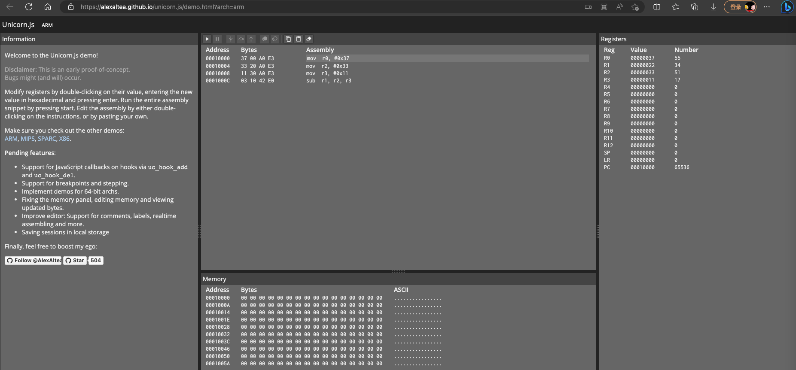

# Unicorn文档和资料

* Unicorn文档和资料
  * 主页
    * GitHub
      * Unicorn CPU emulator framework (ARM, AArch64, M68K, Mips, Sparc, X86)
        * https://github.com/unicorn-engine/unicorn
    * 官网
      * Unicorn – The ultimate CPU emulator
        * http://www.unicorn-engine.org
  * 官网文档
    * [Documentation – Unicorn – The Ultimate CPU emulator (unicorn-engine.org)](https://www.unicorn-engine.org/docs/)
    * 入门教程：C和Python
      * [Programming with C & Python languages – Unicorn – The Ultimate CPU emulator (unicorn-engine.org)](https://www.unicorn-engine.org/docs/tutorial.html)
  * 其他实例代码
    * C
      * [unicorn/samples at master · unicorn-engine/unicorn · GitHub](https://github.com/unicorn-engine/unicorn/tree/master/samples)
        * arm
          * https://github.com/unicorn-engine/unicorn/blob/master/samples/sample_arm.c
          * https://github.com/unicorn-engine/unicorn/blob/master/samples/sample_arm64.c
        * x86
          * https://github.com/unicorn-engine/unicorn/blob/master/samples/sample_x86.c
    * Python
      * [unicorn/bindings/python at master · unicorn-engine/unicorn · GitHub](https://github.com/unicorn-engine/unicorn/tree/master/bindings/python)
        * arm
          * https://github.com/unicorn-engine/unicorn/blob/master/bindings/python/sample_arm.py
          * https://github.com/unicorn-engine/unicorn/blob/master/bindings/python/sample_arm64.py
          * https://github.com/unicorn-engine/unicorn/blob/master/bindings/python/sample_arm64eb.py
          * https://github.com/unicorn-engine/unicorn/blob/master/bindings/python/sample_armeb.py
        * x86
          * https://github.com/unicorn-engine/unicorn/blob/master/bindings/python/sample_x86.py
  * （Unicorn Engine的）API接口文档
    * 非官方
      * C
        * 中文
          * [Unicorn-Engine-Documentation/Unicorn-Engine Documentation.md at master · kabeor/Unicorn-Engine-Documentation (github.com)](https://github.com/kabeor/Unicorn-Engine-Documentation/blob/master/Unicorn-Engine%20Documentation.md)
        * 英文
          * [Unicorn Engine Reference (Unofficial) - HackMD](https://hackmd.io/@K-atc/rJTUtGwuW?type=view)
  * FAQ
    * [unicorn/FAQ.md at master · unicorn-engine/unicorn · GitHub](https://github.com/unicorn-engine/unicorn/blob/master/docs/FAQ.md)
  * 其他
    * Unicorn和QEMU的关系和对比
      * [Unicorn & QEMU – Unicorn – The Ultimate CPU emulator (unicorn-engine.org)](https://www.unicorn-engine.org/docs/beyond_qemu.html)
    * Unicorn实现细节
      * PDF: 《BlackHat USA 2015 slides》 == Unicorn: next generation CPU emulator framework
        * https://www.unicorn-engine.org/BHUSA2015-unicorn.pdf
        * https://github.com/unicorn-engine/unicorn/blob/master/docs/BHUSA2015-unicorn.pdf
    * 自己编译
      * [unicorn/COMPILE.md at master · unicorn-engine/unicorn · GitHub](https://github.com/unicorn-engine/unicorn/blob/master/docs/COMPILE.md)
    * 部分网上资源
      * [Running arm64 code on your Intel Mac 🖥 using Unicorn emulator | 🇺🇦 danylokos’s blog](https://danylokos.github.io/0x04/)
      * Unicorn的一些笔记和用法
        * [alexander-hanel/unicorn-engine-notes: Notes on using the Python bindings for the Unicorn Engine (github.com)](https://github.com/alexander-hanel/unicorn-engine-notes)
      * hook函数写法
        * debug_utils.py
          * [AndroidNativeEmu/debug_utils.py at 8568b316720c6cb543be32562491b3fc172dc6c0 · AeonLucid/AndroidNativeEmu · GitHub](https://github.com/AeonLucid/AndroidNativeEmu/blob/8568b316720c6cb543be32562491b3fc172dc6c0/samples/debug_utils.py)
        * main.py
          * [frick/main.py at 5a60bc8fe8ddcac146853ad22b64e3bac7930269 · iGio90/frick (github.com)](https://github.com/iGio90/frick/blob/5a60bc8fe8ddcac146853ad22b64e3bac7930269/main.py#L1270)
  * 在线工具
    * 在线模拟unicorn去运行arm汇编代码
      * [Unicorn.js: ARM (alexaltea.github.io)](https://alexaltea.github.io/unicorn.js/demo.html?arch=arm)
        * 
