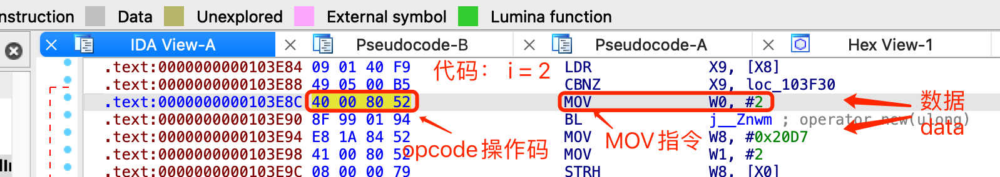
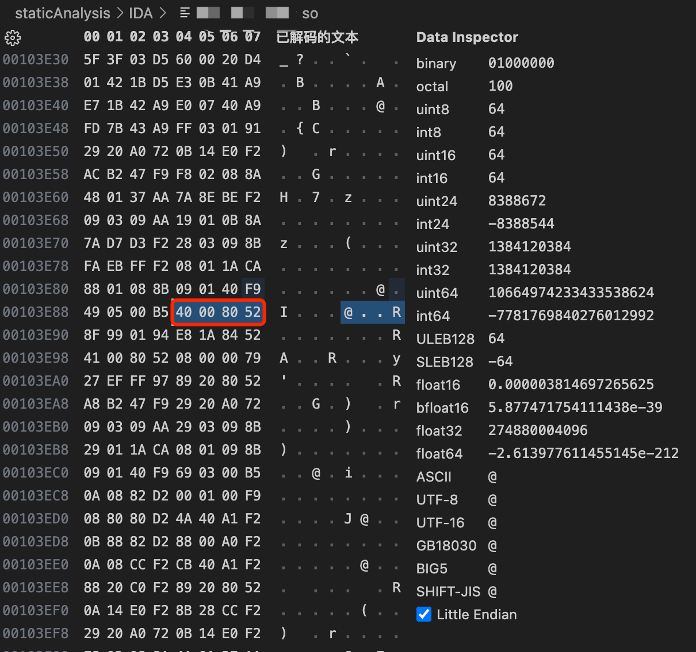

# 什么是：指令=数据=操作码=二进制

先明白一下常说的概念和逻辑：

* `指令`=`instruction` == `代码`=`code` == `操作码`=`opcode` == `二进制`(`数据`) == `binary` (`data`)

分别解释大概的含义：

* `代码` = `code`
  * 往往是高级语言常用到的名字
  * 比如：iOS的ObjC的代码
* `指令` = `instruction`
  * 往往是底层会汇编代码级别，才会用到这个名词，指令。
  * 比如：ARM汇编指令
* `操作码` = `opcode` = `operation code`
  * = **操作机器的代码**
    * 机器 = CPU -》 操作CPU（让其按照你的预期）去工作的代码
  * 往往是底层某个架构对应的指令集中才会用到这个名字，opcode
  * 比如：ARM指令集特定的指令的opcode
* `二进制`（`数据`） = `binary` (`data`)
  * 最底层的硬件中所保存的数据，都是0101的形式的二进制数据

综合起来就是：

你的上层语言的`代码`（比如iOS的ObjC），经过编译，最终底层生成的都是`二进制数据`

而这些二进制数据，对应着（比如ARM指令集中的）`指令`，也就是对应指令的`操作码`（可以通过查询ARM手册，从二进制的0101等数据，慢慢反推出对应是具体什么指令）

## 举例说明

此处，用IDA中某个（安卓so库）二进制中某行指令去举例说明：

* 
  * 比如是上层的，高级语言，C语言的代码
    * **代码**：`i = 2`
  * 被编译后，最底层，最核心的就是（类似的）：
    * **汇编指令**：`MOV W0, #2`
      * 其中假设临时变量`i`被保存到此处的寄存器`W0`中
        * 对应的代码含义就是：把整数数字`2`，赋值给寄存器`W0`
  * 而整条的指令对应的：
    * **操作码**=`opcode`：`40 00 80 52`
      * 即上面那条汇编指令`MOV W0, #2`，被ARM64编码==被编译器编译成最底层的ARM64的汇编代码指令就是：`40 00 80 52`
  * 而上述所有内容，理论上都可以叫做：
    * **数据**=`data`
    * 而如果更加严谨点，则往往会把上面的
      * 操作码=最底层保存的二进制数据，叫做：`（二进制）数据`=`(binary) data`
        * 此处，（用VSCode编辑器去）打开对应二进制文件中，看到的数据，就是这种效果：
            * 
              * `0x103E8C`处，接下来4个字节的**二进制数据**=`binary data`，分别是：`40 00 80 52` = `0x40`、`0x00`、`0x80`、`0x52`4个字节（的二进制数据）
