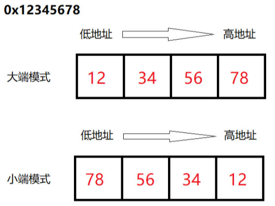

# 字节序endian

写入内容（代码，数据）到内存中之前，要注意先确认`字节序`=`endian`是`大端`还是`小端`

## 大端big endian vs 小端 little endian

* 文字
  * 大小端：0x12345678
    * 大端：高字节放低地址
      * 0x00-0x07：12 34 56 78
    * 小端：高字节 放 高地址
      * 0x00-0x07：78 56 34 12
* 图
  * 

## Unicorn中endian设置

ARM中，默认是`小端`=`UC_MODE_LITTLE_ENDIAN`

除非特殊需要，才会设置为`大端`=`UC_MODE_BIG_ENDIAN`

比如，官网例子给出了演示如何设置大端的用法：

[unicorn/sample_arm64eb.py at master · unicorn-engine/unicorn · GitHub](https://github.com/unicorn-engine/unicorn/blob/master/bindings/python/sample_arm64eb.py)

```py
    print("Emulate ARM64 Big-Endian code")
    try:
        # Initialize emulator in ARM mode
        mu = Uc(UC_ARCH_ARM64, UC_MODE_ARM | UC_MODE_BIG_ENDIAN)
```
