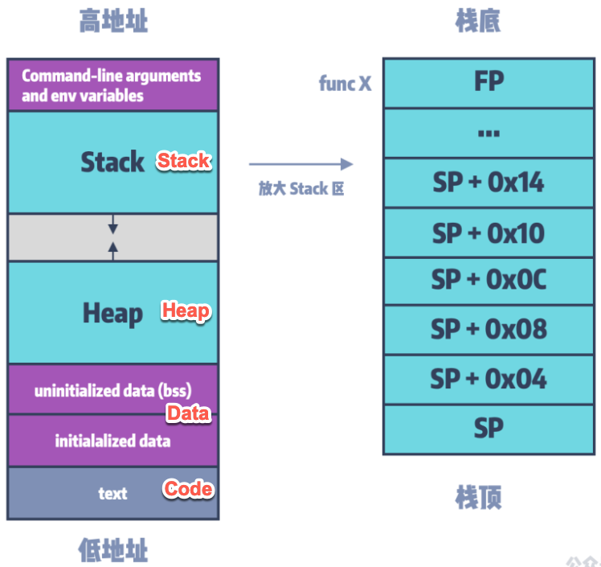

# 典型的内存布局

搞懂了什么是内存布局，再来聊聊，典型的常见的内存布局。

常见的内存布局，内容很多。

用如下图（别人画的，我加了点内容），大概先解释一下，好让大家有个概念：

* （程序的）典型的内存布局
    * 

## 内存布局举例

下面，通过具体例子，来解释，内存布局的细节含义：

### 官网示例代码中的内存布局

已我们前面[运行测试代码](https://book.crifan.org/books/cpu_emulator_unicorn/website/init/run_test_code.html)中用到的官网示例代码[unicorn/sample_arm.py](https://github.com/unicorn-engine/unicorn/blob/master/bindings/python/sample_arm.py)来说，其中就是：

* 要模拟执行的代码code
    * 具体是什么：`ARM_CODE   = b"\x37\x00\xa0\xe3\x03\x10\x42\xe0" # mov r0, #0x37; sub r1, r2, r3`
    * 具体放到内存什么地方=范围：`ADDRESS    = 0x10000`

意思是：

把代码`\x37\x00\xa0\xe3\x03\x10\x42\xe0`放到内存地址为`0x10000`开始的地方

就没了。是的。即没有我们提到的，函数参数，也没有Stack、Heap，特定地址写入特定值等内容

因为，此处要模拟的，只是一个代码片段，不是一个完整的函数。

此处只是官网示例的代码，用于演示运行，确保Unicorn模拟环境正常而已。所以没有用完整的函数，只是一小段代码而已。

此时的内存布局，可以理解为：

```bash
Mapped memory: Code     [0x0000000000010000 - 4GB]
```

或：

```bash
Mapped memory: Code     [0x0000000000010000 - 0x0000000000010008]
```

其中：0x0000000000010008 - 0x0000000000010000 = 8 = 上述代码的大小=字节个数

### 实际例子中的内存布局

之前自己某个Unicorn模拟函数的代码，中的内存布局：

早期是：

```bash
Mapped memory: Code     [0x0000000000010000-0x0000000000410000]
Mapped memory: Libc     [0x0000000000500000-0x0000000000580000]
Mapped memory: Heap     [0x0000000000600000-0x0000000000700000]
Mapped memory: Stack    [0x0000000000700000-0x0000000000800000]
Mapped memory: Args     [0x0000000000800000-0x0000000000810000]
```

经过多次优化，最后是：

```bash
Mapped memory: Code    [0x00010000-0x00410000]
                         [0x00010000-0x000124C8] func: ___lldb_unnamed_symbol2575$$akd
                         [0x00031220-0x00033450]   fix br err: x9SmallOffset
                         [0x00068020-0x00069B80]   fix br err: x10AbsFuncAddrWithOffset
                         [0x00069B88-0x00069B90]   emulateFree jump
                         [0x00069BC0-0x00069BC8]   emulateAkdFunc2567 jump
                         [0x00069BD8-0x00069BE0]   emulateMalloc jump
                         [0x00069BE8-0x00069BF0]   line 7392 jump
                         [0x00069C08-0x00069C10]   emulateDemalloc jump
                         [0x00200000-0x00200004] func: emulateMalloc
                         [0x00220000-0x00220004] func: emulateFree
                         [0x00280000-0x00280004] func: emulateAkdFunc2567
Mapped memory: Libc    [0x00500000-0x00580000]
Mapped memory: Heap    [0x00600000-0x00700000]
Mapped memory: Stack   [0x00700000-0x00800000]
Mapped memory: Args    [0x00800000-0x00810000]
```

具体布局的详细解释，详见后续章节：

[模拟akd函数symbol2575](../../../examples/example_akd_symbol2575.md)
