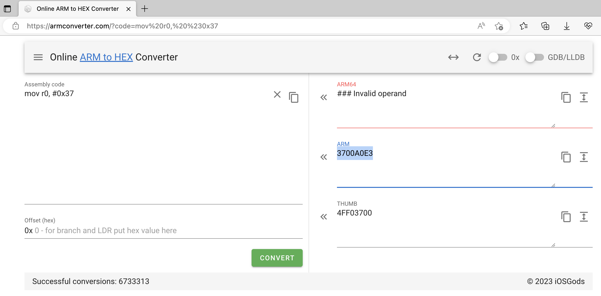
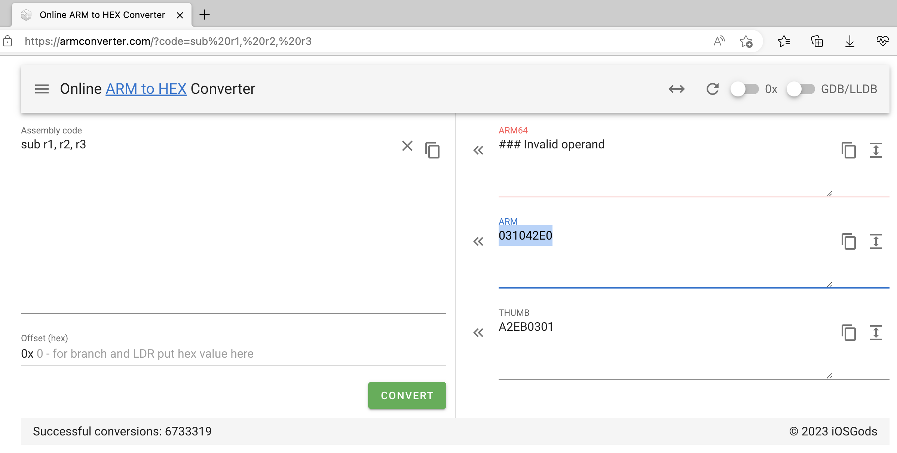
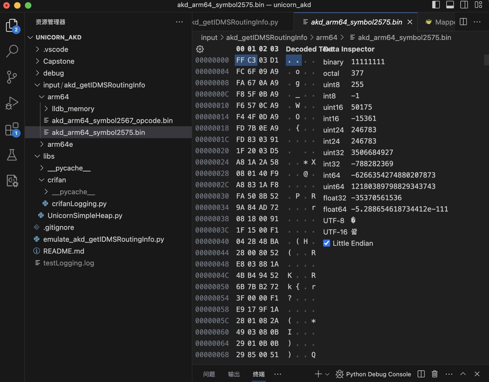

# 设置代码

如果要让CPU能运行你的指令，你要先去把你的代码，放到内存中，供CPU读取。

所以，第一个优先要放到内存中的，就是：`代码`。

* 注：代码==指令==二进制==opcode

而你把代码放到具体哪个位置，就是内存布局中，代码的地址空间范围。

## 举例

### 官网示例

官网示例 [unicorn/sample_arm.py](https://github.com/unicorn-engine/unicorn/blob/master/bindings/python/sample_arm.py) 中的：

```py
# code to be emulated
ARM_CODE   = b"\x37\x00\xa0\xe3\x03\x10\x42\xe0" # mov r0, #0x37; sub r1, r2, r3
```

就是对应的：要运行的代码

被翻译成ARM汇编的话，对应的内容就是，代码后面的注释的部分

```asm
mov r0, #0x37
sub r1, r2, r3
```

#### 怎么看出来上面的二进制就是上面的ARM汇编代码的？

如之前：[什么是指令](../../../how_use/background/core_logic/what_is_instruction.md) 所解释的：

此处的 二进制 == ARM的指令

而具体如何看出来：

* 二进制：`\x37\x00\xa0\xe3\x03\x10\x42\xe0`

就是对应的ARM汇编代码：

```asm
mov r0, #0x37
sub r1, r2, r3
```

则可以：

* 要么是自己手动去分析，把二进制一点点根据对应的bit位，手动分析出对应的汇编指令
  * 详见：[最流行汇编语言：ARM (crifan.org)](https://book.crifan.org/books/popular_assembly_arm/website/)
* 要么是，可以借助工具
  * 在线网站：把二进制转换成ARM汇编指令
    * [Online ARM to HEX Converter (armconverter.com)](https://armconverter.com/)

此处以在线网站

[Online ARM to HEX Converter (armconverter.com)](https://armconverter.com/)

举例来说明：

* ARM汇编指令`mov r0, #0x37`对应的ARM的`指令`=`二进制`是：`3700A0E3` = `\x37\x00\xA0\xE3`
  * 
* ARM汇编指令`sub r1, r2, r3`对应的ARM的`指令`=`二进制`是：`031042E0` == `\x03\x10\x42\xE0`
  * 

-》把 `\x37\x00\xA0\xE3`和`\x03\x10\x42\xE0`加起来，就是此处的二进制：`\x37\x00\xa0\xe3\x03\x10\x42\xe0` 了。

### 自己的实例

自己在后续示例

[模拟akd函数symbol2575](../../../examples/example_akd_symbol2575.md)

中，其中的设置代码的部分就是：

```py
def readBinFileBytes(inputFilePath):
    fileBytes = None
    with open(inputFilePath, "rb") as f:
        fileBytes = f.read()
    return fileBytes

# for arm64: ___lldb_unnamed_symbol2575$$akd
akd_symbol2575_FilePath = "input/akd_getIDMSRoutingInfo/arm64/akd_arm64_symbol2575.bin"
logging.info("akd_symbol2575_FilePath=%s", akd_symbol2575_FilePath)
ARM64_CODE_akd_symbol2575 = readBinFileBytes(akd_symbol2575_FilePath) # b'\xff\xc3\x03\xd1\xfco\t\xa9\xfag\n\xa9\xf8_\x0b\xa9\xf6W\x0c\xa9\xf4O
```

就是从，输入文件

* `input/akd_getIDMSRoutingInfo/arm64/akd_arm64_symbol2575.bin`
  * 

中，读取对应代码=二进制数据，供后续模拟运行的。

而该文件的数据是来自于，lldb调试期间，从内存中导出的：

```bash
(lldb) memory read --binary --force --outfile /Users/crifan/dev/tmp/lldb_mem_dump/akd_arm64_symbol2575.bin 0x10485d98c 0x1048600dc
10064 bytes written to '/Users/crifan/dev/tmp/lldb_mem_dump/akd_arm64_symbol2575.bin'
```

其中`0x10485d98c`和`0x1048600dc`是该函数的起始地址和结束地址。
