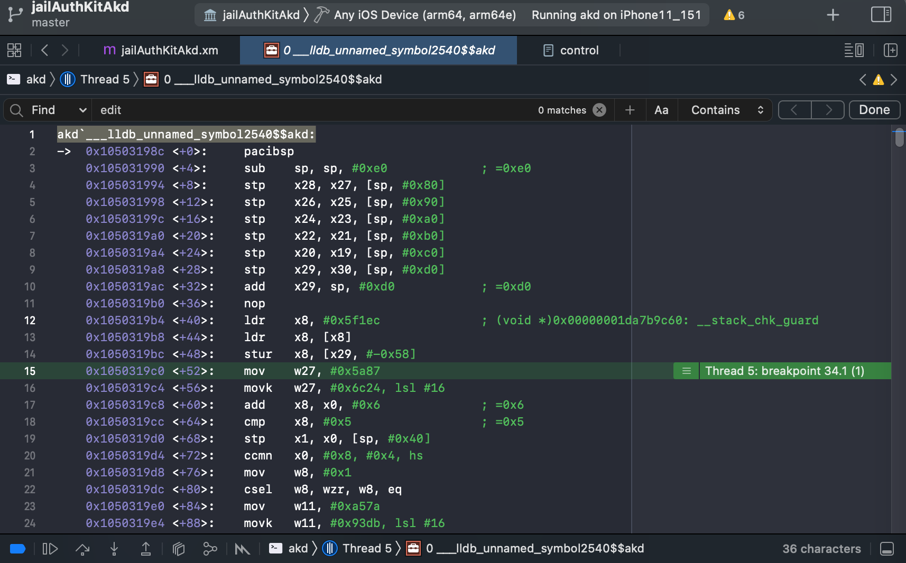
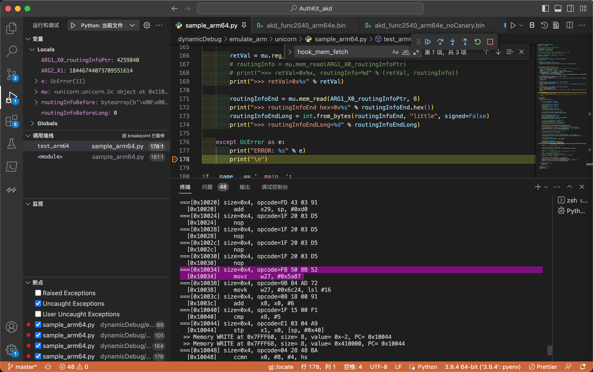

# Capstone

此处实现，查看当前正在执行的指令，的目的所用到的反汇编工具是：`Capstone`

* `Capstone`
  * 官网：https://www.capstone-engine.org/
    * logo
      * 
  * 一句话概述：The Ultimate Disassembler

## Capstone初始化开发环境

### Mac中安装Capstone

* 先安装Capstone的**core**
  * 命令
    ```bash
    brew install capstone
    ```
  * 注：查看已安装信息
    * `brew info capstone`
      * 已安装版本：`capstone: stable 4.0.2 (bottled), HEAD`
* 再安装对应的**binding**
  * Python
    * 命令
      ```bash
      sudo pip install capstone
      ```
    * 注：
      * 查看已安装信息
        * `pip show capstone`
      * 已安装的版本：`Capstone: 4.0.2`

### 测试Capstone运行正常

用Capstone的Python测试代码：

* X86

```py
# test1.py
from capstone import *

CODE = b"\x55\x48\x8b\x05\xb8\x13\x00\x00"

md = Cs(CS_ARCH_X86, CS_MODE_64)
for i in md.disasm(CODE, 0x1000):
  print("0x%x:\t%s\t%s" %(i.address, i.mnemonic, i.op_str))
```

预期输出：

```bash
0x1000: push    rbp
0x1001: mov     rax, qword ptr [rip + 0x13b8]
```

* arm64

```py
from capstone import *
from capstone.arm64 import *

CODE = b"\xe1\x0b\x40\xb9\x20\x04\x81\xda\x20\x08\x02\x8b"

md = Cs(CS_ARCH_ARM64, CS_MODE_ARM)
md.detail = True

for insn in md.disasm(CODE, 0x38):
    print("0x%x:\t%s\t%s" %(insn.address, insn.mnemonic, insn.op_str))

    if len(insn.operands) > 0:
        print("\tNumber of operands: %u" %len(insn.operands))
        c = -1
        for i in insn.operands:
            c += 1
            if i.type == ARM64_OP_REG:
                print("\t\toperands[%u].type: REG = %s" %(c, insn.reg_name(i.value.reg)))
            if i.type == ARM64_OP_IMM:
                print("\t\toperands[%u].type: IMM = 0x%x" %(c, i.value.imm))
            if i.type == ARM64_OP_CIMM:
                print("\t\toperands[%u].type: C-IMM = %u" %(c, i.value.imm))
            if i.type == ARM64_OP_FP:
                print("\t\toperands[%u].type: FP = %f" %(c, i.value.fp))
            if i.type == ARM64_OP_MEM:
                print("\t\toperands[%u].type: MEM" %c)
                if i.value.mem.base != 0:
                    print("\t\t\toperands[%u].mem.base: REG = %s" \
                        %(c, insn.reg_name(i.value.mem.base)))
                if i.value.mem.index != 0:
                    print("\t\t\toperands[%u].mem.index: REG = %s" \
                        %(c, insn.reg_name(i.value.mem.index)))
                if i.value.mem.disp != 0:
                    print("\t\t\toperands[%u].mem.disp: 0x%x" \
                        %(c, i.value.mem.disp))

            if i.shift.type != ARM64_SFT_INVALID and i.shift.value:
                print("\t\t\tShift: type = %u, value = %u" %(i.shift.type, i.shift.value))

            if i.ext != ARM64_EXT_INVALID:
                print("\t\t\tExt: %u" %i.ext)

    if insn.writeback:
        print("\tWrite-back: True")
    if not insn.cc in [ARM64_CC_AL, ARM64_CC_INVALID]:
        print("\tCode condition: %u" %insn.cc)
    if insn.update_flags:
        print("\tUpdate-flags: True")
```

预期输出：

```bash
0x38:   ldr     w1, [sp, #8]
        Number of operands: 2
                operands[0].type: REG = w1
                operands[1].type: MEM
                        operands[1].mem.base: REG = sp
                        operands[1].mem.disp: 0x8
0x3c:   cneg    x0, x1, ne
        Number of operands: 2
                operands[0].type: REG = x0
                operands[1].type: REG = x1
        Code condition: 2
0x40:   add     x0, x1, x2, lsl #2
        Number of operands: 3
                operands[0].type: REG = x0
                operands[1].type: REG = x1
                operands[2].type: REG = x2
                        Shift: type = 1, value = 2
```

-> 更多测试代码，详见：

* [Programming with Python language – Capstone – The Ultimate Disassembler (capstone-engine.org)](http://www.capstone-engine.org/lang_python.html)
* [capstone/bindings/python at master · capstone-engine/capstone · GitHub](https://github.com/capstone-engine/capstone/tree/master/bindings/python)

## 日志优化：借助于Capstone打印当前正在执行的指令

自己的实际代码 [模拟akd函数symbol2575](../../../../examples/example_akd_symbol2575.md) 中的 `hook_code` 中的这部分的代码：

```py
from capstone import *
from capstone.arm64 import *

BYTES_PER_LINE = 4

# Init Capstone instance
cs = Cs(CS_ARCH_ARM64, CS_MODE_ARM + CS_MODE_LITTLE_ENDIAN)
cs.detail = True

#-------------------- Code --------------------

# memory address where emulation starts
CODE_ADDRESS = 0x10000
# code size: 4MB
CODE_SIZE = 4 * 1024 * 1024
CODE_ADDRESS_END = (CODE_ADDRESS + CODE_SIZE) # 0x00410000


def bytesToOpcodeStr(curBytes):
    opcodeByteStr = ''.join('{:02X} '.format(eachByte) for eachByte in curBytes)
    return opcodeByteStr

# callback for tracing instructions
def hook_code(mu, address, size, user_data):

    # logging.info(">>> Tracing instruction at 0x%x, instruction size = 0x%x", address, size)
    lineCount = int(size / BYTES_PER_LINE)
    for curLineIdx in range(lineCount):
        startAddress = address + curLineIdx * BYTES_PER_LINE
        codeOffset = startAddress - CODE_ADDRESS
        opcodeBytes = mu.mem_read(startAddress, BYTES_PER_LINE)
        opcodeByteStr = bytesToOpcodeStr(opcodeBytes)
        decodedInsnGenerator = cs.disasm(opcodeBytes, address)
        # if gSingleLineCode:
        for eachDecodedInsn in decodedInsnGenerator:
            eachInstructionName = eachDecodedInsn.mnemonic
            offsetStr = "<+%d>" % codeOffset
            logging.info("--- 0x%08X %7s: %s -> %s\t%s", startAddress, offsetStr, opcodeByteStr, eachInstructionName, eachDecodedInsn.op_str)

...
def emulate_akd_arm64_symbol2575():
...
        mu.hook_add(UC_HOOK_CODE, hook_code, begin=CODE_ADDRESS, end=CODE_ADDRESS_END)
```

主要目的就是：

优化了log日志打印，希望打印输出的内容，尽量贴近之前Xcode调试（iOS的ObjC的）ARM汇编代码的（lldb反汇编的）显示效果：

```asm
libobjc.A.dylib`objc_alloc_init:
->  0x19cbd3c3c <+0>:  stp    x29, x30, [sp, #-0x10]!
    0x19cbd3c40 <+4>:  mov    x29, sp
    0x19cbd3c44 <+8>:  cbz    x0, 0x19cbd3c5c          ; <+32>
    0x19cbd3c48 <+12>: ldr    x8, [x0]
    0x19cbd3c4c <+16>: and    x8, x8, #0xffffffff8
    0x19cbd3c50 <+20>: ldrb   w8, [x8, #0x1d]
    ...
```

即，是类似于这种格式：

* 当前地址 <+偏移量>: 指令 操作数

且还希望，加上IDA中能显示opcode的信息：

* 当前地址 <+偏移量>: opcode -> 指令 操作数

所以最后经过优化，用上述代码，实现了类似Xcode中的输出效果：

```asm
--- 0x000113AC <+5036>: 28 01 08 0B  -> add    w8, w9, w8
--- 0x000113B0 <+5040>: 08 09 01 11  -> add    w8, w8, #0x42
--- 0x000113B4 <+5044>: 28 DB A8 B8  -> ldrsw  x8, [x25, w8, sxtw #2]
--- 0x000113B8 <+5048>: 1F 20 03 D5  -> nop
--- 0x000113BC <+5052>: 29 D4 2B 58  -> ldr    x9, #0x68e40
--- 0x000113C0 <+5056>: 08 01 09 8B  -> add    x8, x8, x9
--- 0x000113C4 <+5060>: 00 01 1F D6  -> br     x8
```

如此，可以方便的查看到：

* 当前代码执行到哪里了== 当前的地址 == PC的值
* 函数内的偏移量
* opcode=指令的二进制值
* （借助Capstone解析后的）当前正在执行什么指令

## Unicorn中使用Capstone的心得

### Unicorn真正执行代码 和 Capstone反编译显示的代码 未必完全一样

Capstone反汇编出来的指令，有些细节和Xcode中不太一样

* 即，用Capstone去反汇编看到的指令，和Unicorn真正执行的指令，未必相同
  * 但是还是可以供参考的，基本上差距不大

#### mov vs movz

* Unicorn底层真正执行的指令 == Xcode反汇编看到的指令：`mov`

```asm
akd`___lldb_unnamed_symbol2540$$akd:
...
    0x1050319c0 <+52>:    mov    w27, #0x5a87
```



* Capstone反编译出的指令：`movz`

```asm
===[0x10034] size=0x4, opcode=FB 50 8B 52 
  [0x10034]     movz    w27, #0x5a87
```



—> 经过确认，其实：是一样的。

细节是：

* `MOV (wide immediate)`
  * 概述
    * Move 16-bit immediate to register.
    * This instruction is an alias of MOVZ.
  * 语法
    * `MOV Wd, #imm`
    * `MOV Xd, #imm`
  * 解释
* `MOVZ`
  * 概述
    * Move shifted 16-bit immediate to register.
    * This instruction is used by the alias MOV (wide immediate).
  * 语法
    * `MOVZ Wd, #imm{, LSL #shift}`
    * `MOVZ Xd, #imm{, LSL #shift}`
* 对比
  * 要移动的立即数imm：
    * `MOV (wide immediate)`
      * 有2种
        * 对于32位的`Wd`：`32位`
        * 对于64位的`Xd`：`64位`
      * -》和MOVZ的16bit比，32位和64位位数**更宽**，所以叫做`wide immediate`
    * `MOVZ`
      * 16位（无符号的立即数）
  * -》而当MOVZ中`shift=0`时，且`imm的值 <=65536` 即`16位`时：
    * `MOV (wide immediate)` == `MOVZ`
      * 举例：当`imm=0x5a87`，多种写法，代码逻辑是一样的
        * `mov w27, #0x5a87`
        * `mov x27, #0x5a87`
        * `movz w27, #0x5a87`
        * `movz x27, #0x5a87`

#### 有些值是计算后的值，而不是指令本身的值 

概述：有些值是计算后的值，而不是指令本身的值

##### 举例1：`adr x25, #0x227e4` vs `adr x25, #0x32850`

Unicorn调试期间，如果也是像我：用到Capstone去，查看当前反汇编后的ARM汇编代码

尤其要注意，对于`adr`等指令，其显示出的值：是**计算后**的值，而不是**原始**的值

比如：

原始ARM汇编指令是：

```asm
adr    x25, #0x227e4
```

而经过`Capstone`去反汇编出来的，却是：

```asm
adr     x25, #0x32850
```

其中的，加上当前PC的值，完整的log是：

```asm
0x0001006C  <+108>: 39 3F 11 10  -> adr     x25, #0x32850
```

可以看出：

* `x25` = `0x32850` = `当前PC` + 指令中的**原始**的偏移量 = `0x0001006C + 0x227e4`

-》否则，不小心就搞错了，以为是：

* `x25` = `0x428BC` = `当前PC` + 指令中的原始的偏移量 = `0x0001006C + 0x32850`

##### 举例2：`LDR x8 #0x5F1EC` vs `LDR x8 #0x6F214`

* 二进制=opcode：`68 8F 2F 58`
  * 条件
    * ARM的little endian 小端
    * ARM64模式
  * 用
    * Xcode
    * 自己手动解码
    * Unicorn
    * Capstone
  * 正常解码出是
    * `LDR x8 #0x5F1EC`
  * 只不过：Unicorn/Capstone，会去继续处理：
    * 根据此处LDR (literal) == LDR (PC-relative literal)的本意：
      * `具体要加载的值` = `offset + PC的值` = `0x5F1EC` + `当前PC值是0x10028 `= `0x6F214`
  * 所以，而是，Unicorn/Capstone中，显示出来的是解码后 + 解析后，最终的结果：
    * `LDR x8 #0x6F214`
  * 以为是解码错误，实际上是：解码正确的
    * 只是显示逻辑上，略有不同而已
