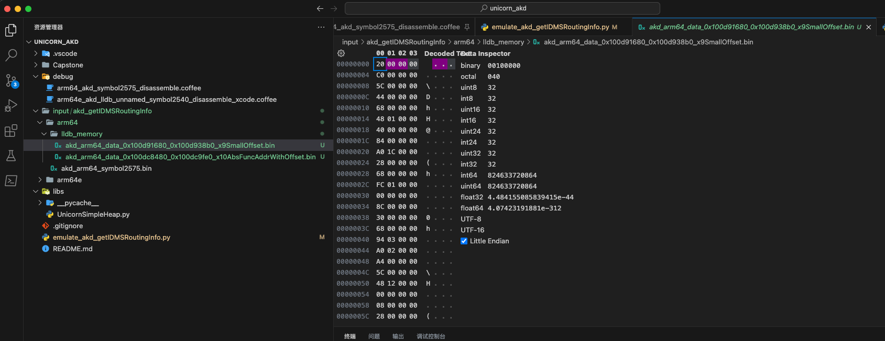
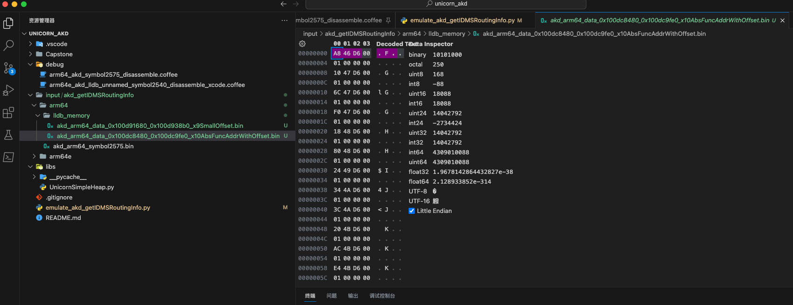

# 批量解决UC_ERR_MAP

后来发现此处被调试的程序，有个通用的逻辑：

给特定内存地址写入特定值，就可以批量的、一次性的，解决后续的br跳转报错UC_ERR_MAP的问题了

注：按照最新的理解，应该也算是，部分的实现了`代码反混淆`=`反代码混淆`=`代码去混淆`了。

* 概述：通过批量写入x9、x10地址相关值，确保了一次性解决了br跳转的问题
  * 详见
    * 【已解决】Unicorn模拟arm64代码：尝试批量一次性解决全部的br跳转导致内存映射错误UC_ERR_MAP

* 详解

## 搞懂___lldb_unnamed_symbol2575$$akd函数br跳转涉及到的固定的值的内存范围

* 【已解决】Unicorn模拟arm64代码：搞懂___lldb_unnamed_symbol2575$$akd函数br跳转涉及到的固定的值的内存范围
* 【已解决】Unicorn模拟arm64代码：计算br跳转涉及到的x10函数偏移量地址的合适的范围
* 【已解决】Unicorn模拟arm64代码：计算br跳转涉及到的x9的合适的范围

通过调试研究：

（1）计算br跳转涉及到的x9的合适的范围 是：

* 0x0000000100d91680 ~ 0x0000000100d938b0
  * = 函数起始地址(0x0000000100d70460)加上：0x21220 ~ 0x23450

对应的内存中保存的数据是：

```asm
(lldb) x/16gw 0x0000000100d91680
0x100d91680: 0x00000020 0x000000c0 0x0000005c 0x00000044
0x100d91690: 0x00000068 0x00000148 0x00000040 0x00000084
0x100d916a0: 0x00001ca0 0x00000028 0x00000068 0x000001fc
0x100d916b0: 0x00000000 0x0000008c 0x00000030 0x00000068

(lldb) x/16gw 0x0000000100d93880
0x100d93880: 0x00000020 0x00000044 0x0000006c 0x000005c4
0x100d93890: 0x00000994 0x000012e0 0x0000005c 0x000000a0
0x100d938a0: 0x00000000 0x000002d8 0x00000068 0x0000043c
0x100d938b0: 0x1001ffff 0x0002b400 0x0c02b400 0xc0000388
```

-> 0x100d91680之后，0x100d938b0之前，都是：小数 像是 偏移量地址。

（2）计算br跳转涉及到的x10函数偏移量地址的合适的范围 是

* x10：保存当前函数有效地址（0x0000000100d6xxx 或 0x0000000100d7xxx）的地址范围是：
  * 0x100dc8480 - 0x100dc9fe0

对应的内存中保存的数据是：

```asm
(lldb) x/16gx 0x100dc8440
0x100dc8440: 0x0000000000000200 0x0000000000000000
0x100dc8450: 0x0000000000000030 0x0000000100ce6d98
0x100dc8460: 0x0000000100cd4ec8 0x0000000100dab23b
0x100dc8470: 0x0000000000000200 0x0000000000000000
0x100dc8480: 0x0000000100d646a8 0x0000000100d64710
0x100dc8490: 0x0000000100d6476c 0x0000000100d647f0
0x100dc84a0: 0x0000000100d64818 0x0000000100d64880
0x100dc84b0: 0x0000000100d64924 0x0000000100d64a34

(lldb) x/16gx 0x100dc9fA0
0x100dc9fa0: 0x0000000100d7d2b4 0x0000000100d7d2d8
0x100dc9fb0: 0x0000000100d7d364 0x0000000100d7d38c
0x100dc9fc0: 0x0000000100d7d4a8 0x0000000100d7d228
0x100dc9fd0: 0x0000000100d7d294 0x0000000100d7c0e4
0x100dc9fe0: 0x00000001a51b2fc7 0x0000000192108102
0x100dc9ff0: 0x0000000100d933b2 0x0000000100de926a
0x100dca000: 0x0000000100de92b0 0x00000001db0441de
0x100dca010: 0x0000000100de92bb 0x0000000100de92b6
```

以及计算偏移量：

```bash
(lldb) p/x 0x100dc8480 - 0x0000000100d70460
(long) $16 = 0x0000000000058020

(lldb) p/x 0x100dc9fe0 - 0x0000000100d70460
(long) $17 = 0x0000000000059b80
```

=> 最后基本上判断出：

涉及到 `___lldb_unnamed_symbol2575$$akd` 的`br`跳转的内存地址范围，主要有2个段：

* **x9**的：`0x100d91680 ~ 0x100d938b0`
  * 当前函数起始地址：`0x0000000100d70460`
    * = 函数起始地址的偏移量：`+0x21220 ~ +0x23450`
* **x10**的：`0x100dc8480 - 0x100dc9fe0`
  * 当前函数起始地址：`0x0000000100d70460`
    * = 函数起始地址的偏移量：`+0x58020 ~ +0x59b80`

## 导出lldb调试时x9和x10两个段的实际数据值到文件

* 【已解决】Unicorn模拟arm64代码：导出lldb调试时x9和x10两个段的实际数据值到文件

通过调试实际代码期间，用lldb去导出的相关的x9和x10的数据文件：

* x9的
  * lldb导出命令：
    ```bash
    (lldb) memory read --binary --force --outfile /Users/crifan/dev/tmp/lldb_mem_dump/akd_arm64_data_0x100d91680_0x100d938b0_x9SmallOffset.bin 0x100d91680 0x100d938b0
    8752 bytes written to '/Users/crifan/dev/tmp/lldb_mem_dump/akd_arm64_data_0x100d91680_0x100d938b0_x9SmallOffset.bin'
    ```
  * 导出的x9的文件
    * 
* x10的
  * lldb导出命令：
    ```bash
    (lldb) memory read --binary --force --outfile /Users/crifan/dev/tmp/lldb_mem_dump/akd_arm64_data_0x100dc8480_0x100dc9fe0_x10AbsFuncAddrWithOffset.bin 0x100dc8480 0x100dc9fe0
    7008 bytes written to '/Users/crifan/dev/tmp/lldb_mem_dump/akd_arm64_data_0x100dc8480_0x100dc9fe0_x10AbsFuncAddrWithOffset.bin'
    ```
  * 导出的x10的文件
    * 

## 修正导出的x10的带偏移量的函数地址

* 【已解决】Unicorn模拟arm64：修正导出的x10的带偏移量的函数地址

其中导出x10的数据中的地址，是absolute的绝对路径，所以此处还要去修复地址

即修改为此处Unicorn模拟时的，函数起始地址+相对偏移量=Unicorn模拟时的地址

用代码：

```py
# Function: process akd_arm64_data_x10AbsFuncAddrWithOffset_fixOffset.bin offset
#   read out stored function abs address
#   remove function start address
#   add new Unicorn emulate address
#   write back
# Author: Crifan Li
# Update: 20230515

################################################################################
# Global Variable
################################################################################

gNoUse = 0

VALUE_GROUP_BYTE_LEN = 8
REAL_FUNC_START_ADDR = 0x0000000100d70460
EMULATE_FUNC_START_ADDR = 0x10000

################################################################################
# Util Function
################################################################################

def readBinFileBytes(inputFilePath):
    fileBytes = None
    with open(inputFilePath, "rb") as f:
        fileBytes = f.read()
    return fileBytes

def writeBytesToFile(outputFile, bytesData):
    with open(outputFile, "wb") as f:
        f.write(bytesData)

################################################################################
# Main
################################################################################

inputX10FuncAbsOffsetFile = "input/akd_getIDMSRoutingInfo/arm64/lldb_memory/akd_arm64_data_0x100dc8480_0x100dc9fe0_x10AbsFuncAddrWithOffset.bin"
print("inputX10FuncAbsOffsetFile=%s" % inputX10FuncAbsOffsetFile)
inputX10AddrBytes = readBinFileBytes(inputX10FuncAbsOffsetFile) # b'\xa8F\xd6\x00\x01\x00\x00\x00\x10G\xd6\x00\x01\x00\x00\x00lG\xd6\x00\x01 ...
inputX10AddrBytesLen = len(inputX10AddrBytes)
print("inputX10AddrBytesLen=%d == 0x%X" % (inputX10AddrBytesLen, inputX10AddrBytesLen))
inputX10AddrValueLen = (int)(inputX10AddrBytesLen / VALUE_GROUP_BYTE_LEN)
print("inputX10AddrValueLen=%d == 0x%X" % (inputX10AddrValueLen, inputX10AddrValueLen))

outputX10EmulateAddrValueBytes = bytearray()

for eachValueIdx in range(inputX10AddrValueLen):
    bytesStartIdx = eachValueIdx * VALUE_GROUP_BYTE_LEN
    bytesEndIdx = (bytesStartIdx + VALUE_GROUP_BYTE_LEN) - 1
    realAddrValueBytes = inputX10AddrBytes[bytesStartIdx:bytesEndIdx]
    realAddrValue = int.from_bytes(realAddrValueBytes, byteorder="little", signed=False)
    relativeOffset = realAddrValue - REAL_FUNC_START_ADDR
    relativeAbsOffset = abs(relativeOffset)
    emulateAddr = EMULATE_FUNC_START_ADDR + relativeOffset
    emuAddrBytes = int.to_bytes(emulateAddr, 8, byteorder="little", signed=False)
    outputX10EmulateAddrValueBytes.extend(emuAddrBytes)
    # print("outputX10EmulateAddrValueBytes=%s" % outputX10EmulateAddrValueBytes.hex())
    print("[0x%04X-0x%04X]=0x%s==0x%016X -> off:%d=abs(0x%X)->emu:0x%X>>%s" % (bytesStartIdx, bytesEndIdx, realAddrValueBytes.hex(), realAddrValue, relativeOffset, relativeAbsOffset, emulateAddr, emuAddrBytes.hex()))
    gNoUse = 0

outputX10EmulateAddrValueByteLen = len(outputX10EmulateAddrValueBytes)
print("\noutputX10EmulateAddrValueByteLen=%d=0x%X" % (outputX10EmulateAddrValueByteLen, outputX10EmulateAddrValueByteLen))

outputX10EmulateFuncAddrFile = "input/akd_getIDMSRoutingInfo/arm64/lldb_memory/akd_arm64_data_x10EmulateAddr.bin"
print("outputX10EmulateFuncAddrFile=%s" % outputX10EmulateFuncAddrFile)

writeBytesToFile(outputX10EmulateFuncAddrFile, outputX10EmulateAddrValueBytes)

gNoUse = 0
```

输出文件：

`input/akd_getIDMSRoutingInfo/arm64/lldb_memory/akd_arm64_data_x10EmulateAddr.bin`

输出log：

```bash
inputX10FuncAbsOffsetFile=input/akd_getIDMSRoutingInfo/arm64/lldb_memory/akd_arm64_data_0x100dc8480_0x100dc9fe0_x10AbsFuncAddrWithOffset.bin
inputX10AddrBytesLen=7008 == 0x1B60
inputX10AddrValueLen=876 == 0x36C
[0x0000-0x0007]=0xa846d600010000==0x0000000100D646A8 -> off:-48568=abs(0xBDB8)->emu:0x4248>>4842000000000000
[0x0008-0x000F]=0x1047d600010000==0x0000000100D64710 -> off:-48464=abs(0xBD50)->emu:0x42B0>>b042000000000000
[0x0010-0x0017]=0x6c47d600010000==0x0000000100D6476C -> off:-48372=abs(0xBCF4)->emu:0x430C>>0c43000000000000
[0x0018-0x001F]=0xf047d600010000==0x0000000100D647F0 -> off:-48240=abs(0xBC70)->emu:0x4390>>9043000000000000
[0x0020-0x0027]=0x1848d600010000==0x0000000100D64818 -> off:-48200=abs(0xBC48)->emu:0x43B8>>b843000000000000
[0x0028-0x002F]=0x8048d600010000==0x0000000100D64880 -> off:-48096=abs(0xBBE0)->emu:0x4420>>2044000000000000
[0x0030-0x0037]=0x2449d600010000==0x0000000100D64924 -> off:-47932=abs(0xBB3C)->emu:0x44C4>>c444000000000000
[0x0038-0x003F]=0x344ad600010000==0x0000000100D64A34 -> off:-47660=abs(0xBA2C)->emu:0x45D4>>d445000000000000
[0x0040-0x0047]=0x3c4ad600010000==0x0000000100D64A3C -> off:-47652=abs(0xBA24)->emu:0x45DC>>dc45000000000000
[0x0048-0x004F]=0x204bd600010000==0x0000000100D64B20 -> off:-47424=abs(0xB940)->emu:0x46C0>>c046000000000000
[0x0050-0x0057]=0xac4bd600010000==0x0000000100D64BAC -> off:-47284=abs(0xB8B4)->emu:0x474C>>4c47000000000000
[0x0058-0x005F]=0xe44bd600010000==0x0000000100D64BE4 -> off:-47228=abs(0xB87C)->emu:0x4784>>8447000000000000

...

[0x1B28-0x1B2F]=0xd8d2d700010000==0x0000000100D7D2D8 -> off:52856=abs(0xCE78)->emu:0x1CE78>>78ce010000000000
[0x1B30-0x1B37]=0x64d3d700010000==0x0000000100D7D364 -> off:52996=abs(0xCF04)->emu:0x1CF04>>04cf010000000000
[0x1B38-0x1B3F]=0x8cd3d700010000==0x0000000100D7D38C -> off:53036=abs(0xCF2C)->emu:0x1CF2C>>2ccf010000000000
[0x1B40-0x1B47]=0xa8d4d700010000==0x0000000100D7D4A8 -> off:53320=abs(0xD048)->emu:0x1D048>>48d0010000000000
[0x1B48-0x1B4F]=0x28d2d700010000==0x0000000100D7D228 -> off:52680=abs(0xCDC8)->emu:0x1CDC8>>c8cd010000000000
[0x1B50-0x1B57]=0x94d2d700010000==0x0000000100D7D294 -> off:52788=abs(0xCE34)->emu:0x1CE34>>34ce010000000000
[0x1B58-0x1B5F]=0xe4c0d700010000==0x0000000100D7C0E4 -> off:48260=abs(0xBC84)->emu:0x1BC84>>84bc010000000000

outputX10EmulateAddrValueByteLen=7008=0x1B60
outputX10EmulateFuncAddrFile=input/akd_getIDMSRoutingInfo/arm64/lldb_memory/akd_arm64_data_x10EmulateAddr.bin
```

## 把导出的x9和x10的2段数据导入到Unicorn模拟代码中

* 【已解决】Unicorn模拟arm64代码：把导出的x9和x10的2段数据导入到Unicorn模拟代码中

而关于批量写入x9、x10地址相关值，用的代码是：

```py
#-------------------- Try fix br jump UC_ERR_MAP --------------------

x9SmallOffsetFile = "input/akd_getIDMSRoutingInfo/arm64/lldb_memory/akd_arm64_data_0x100d91680_0x100d938b0_x9SmallOffset.bin"
print("x9SmallOffsetFile=%s" % x9SmallOffsetFile)
x9SmallOffsetBytes = readBinFileBytes(x9SmallOffsetFile)
x9SmallOffsetBytesLen = len(x9SmallOffsetBytes) # b' \x00\x00\x00\xc0\x00\x00\x00\\\x00\x00\x00D\x00\x00\x00h\x00\x00\x00H\x01 ...
print("x9SmallOffsetBytesLen=%d=0x%X" % (x9SmallOffsetBytesLen, x9SmallOffsetBytesLen))

x9SmallOffsetStartAddress = CODE_ADDRESS + 0x21220
print("x9SmallOffsetStartAddress=0x%X" % x9SmallOffsetStartAddress)

# x10AbsFuncAddrWithOffsetFile = "input/akd_getIDMSRoutingInfo/arm64/lldb_memory/akd_arm64_data_0x100dc8480_0x100dc9fe0_x10AbsFuncAddrWithOffset.bin"
x10AbsFuncAddrWithOffsetFile = "input/akd_getIDMSRoutingInfo/arm64/lldb_memory/akd_arm64_data_x10EmulateAddr.bin"
print("x10AbsFuncAddrWithOffsetFile=%s" % x10AbsFuncAddrWithOffsetFile)
x10AbsFuncAddrWithOffsetBytes = readBinFileBytes(x10AbsFuncAddrWithOffsetFile)
# x10AbsFuncAddrWithOffsetBytesLen = len(x10AbsFuncAddrWithOffsetBytes) # b'\xa8F\xd6\x00\x01\x00\x00\x00\x10G\xd6\x00\x01\x00\x00\x00lG\xd6\x00\x01 ...
x10AbsFuncAddrWithOffsetBytesLen = len(x10AbsFuncAddrWithOffsetBytes) # b'HB\x00\x00\x00\x00\x00\x00\xb0B\x00\x00\x00\x00\x00\x00\x0cC\x00\x00\x00\ ...
print("x10AbsFuncAddrWithOffsetBytesLen=%d=0x%X" % (x10AbsFuncAddrWithOffsetBytesLen, x10AbsFuncAddrWithOffsetBytesLen)) # x10AbsFuncAddrWithOffsetBytesLen=7008=0x1B60

x10AbsFuncAddrWithOffsetStartAddress = CODE_ADDRESS + 0x58020
print("x10AbsFuncAddrWithOffsetStartAddress=0x%X" % x10AbsFuncAddrWithOffsetStartAddress)

...

        mu.mem_write(x9SmallOffsetStartAddress, x9SmallOffsetBytes)
        print(" >> has write %d=0x%X bytes into memory [0x%X-0x%X]" % (x9SmallOffsetBytesLen, x9SmallOffsetBytesLen, x9SmallOffsetStartAddress, x9SmallOffsetStartAddress + x9SmallOffsetBytesLen))
        mu.mem_write(x10AbsFuncAddrWithOffsetStartAddress, x10AbsFuncAddrWithOffsetBytes)
        print(" >> has write %d=0x%X bytes into memory [0x%X-0x%X]" % (x10AbsFuncAddrWithOffsetBytesLen, x10AbsFuncAddrWithOffsetBytesLen, x10AbsFuncAddrWithOffsetStartAddress, x10AbsFuncAddrWithOffsetStartAddress + x10AbsFuncAddrWithOffsetBytesLen))
...
        # writeMemory(0x32850, 0x00000094, 4)             # <+236>: 29 DB A9 B8  -> ldrsw   x9, [x25, w9, sxtw #2]
        # readMemory(0x32850, 4)
        # writeMemory(0x32870, 0xffffdbc4, 4)     # <+116>: 29 DB A9 B8  -> ldrsw   x9, [x25, w9, sxtw #2]
        # readMemory(0x32870, 4)
        # writeMemory(0x68CF8, CODE_ADDRESS_REAL_END, 8)  # <+124>: EA 63 2C 58  -> ldr     x10, #0x68cf8
        # readMemory(0x68CF8, 8)
        # writeMemory(0x68D00, 0x1008C, 8)        # <+244>: 6A 60 2C 58  -> ldr     x10, #0x68d00
        # readMemory(0x68D00, 8)
        # writeMemory(0x32858, 0xc4, 4)           # <+364>: 28 DB A8 B8  -> ldrsw   x8, [x25, w8, sxtw #2]
        # readMemory(0x32858, 4)
        # writeMemory(0x68D08, 0x10120, 8)        # <+372>: AA 5C 2C 58  -> ldr     x10, #0x68d08
        # readMemory(0x68D08, 8)
```

即可，批量的，一次性的解决了之前br跳转导致内存映射报错的问题。

效果对比：

* 之前：用Unicorn调试，耗时很久，才一点点调试到300多行，且遇到多次br跳转问题
* 现在：这下代码至少一次性的运行到了 <+4404> 即 4000多行，才出现其他问题。
