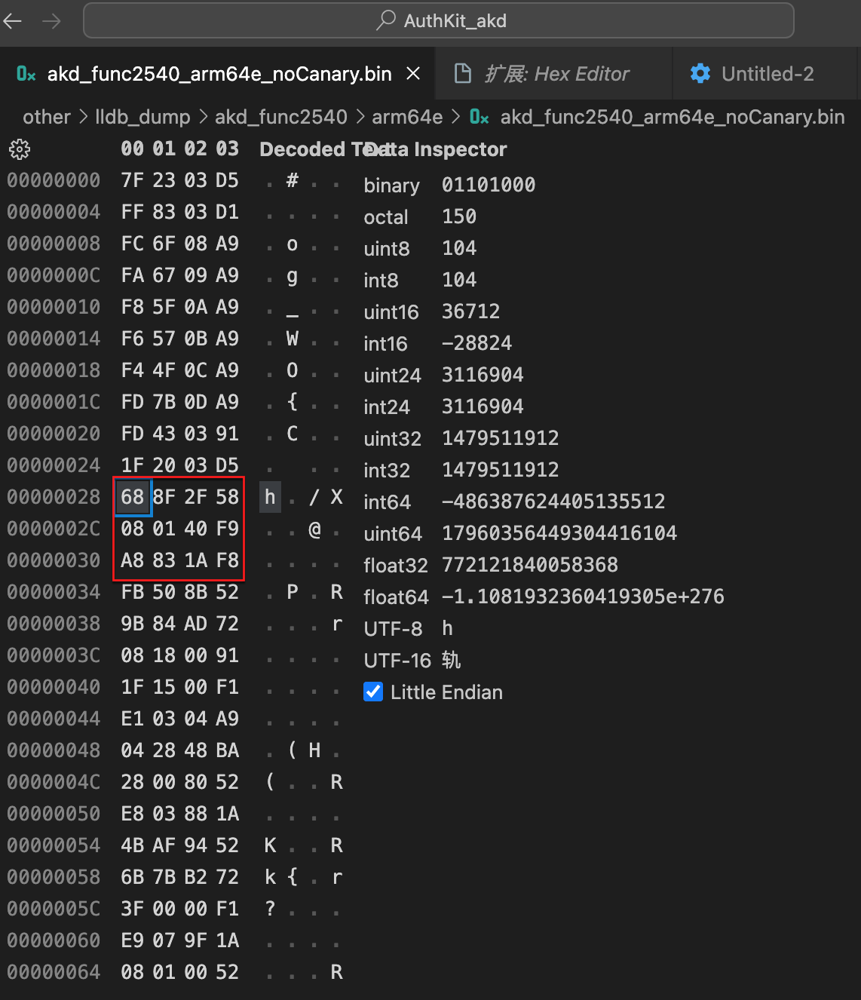
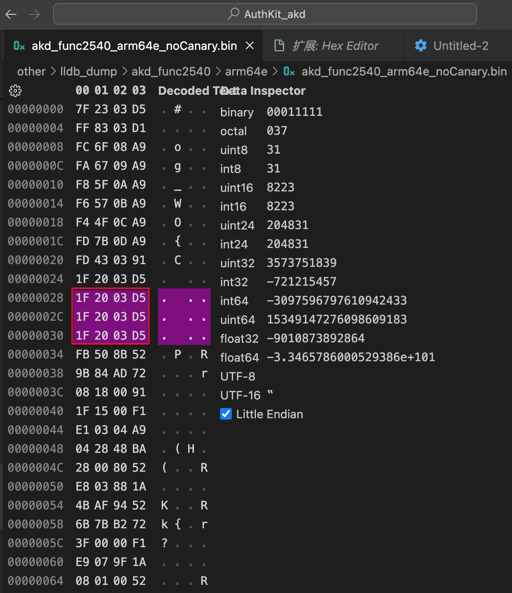
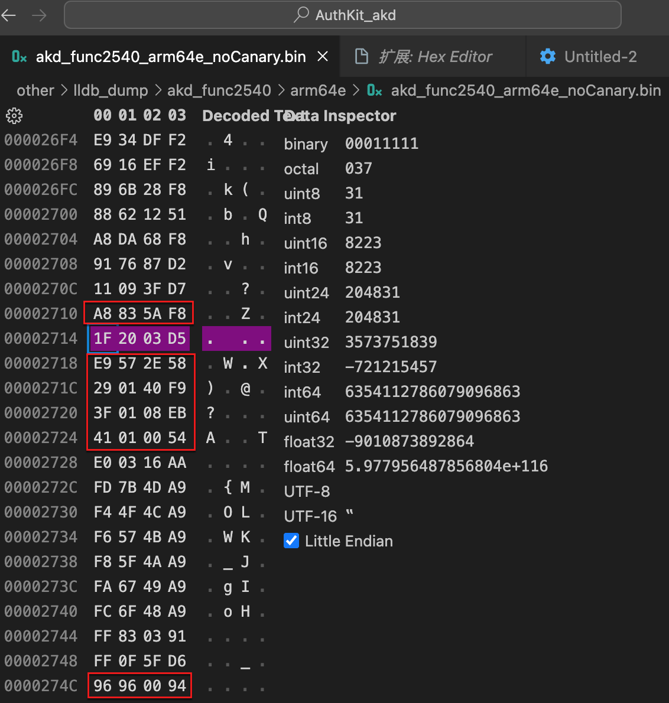
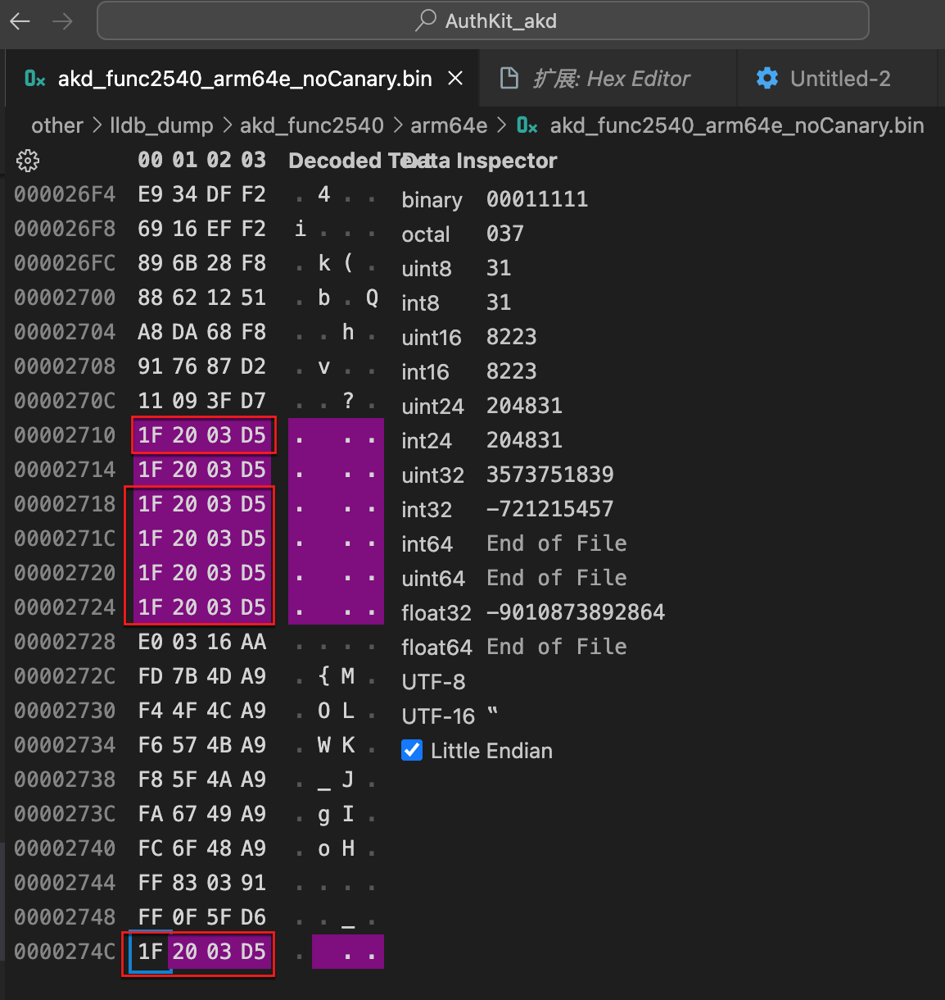

# 手动修改指令

如果指令不好模拟，数量不多的话，可以考虑手动修改原始二进制：

## 举例1：手动替换指令，比如`braa`变`br`

如果此处模拟的代码是`arm64e`的，但Unicorn本身暂时又不支持`arm64e`的话，对于PAC指令`braa`来说，就无法执行

而如果这里指令数量不是很多的话，就可以考虑：手动处理，比如替换成`br`。

* 举例

【已解决】Unicorn模拟ARM64代码：手动把braa改为br指令看是否还会报错UC_ERR_EXCEPTION

中的，去把：

* PC=0x0001009C
  * 原先opcode：`31 09 1F D7`
    * `BRAA x9, x17`
  * 改为opcode：`20 01 1F D6`
    * `BR X9`

## 举例2：其他指令变nop空指令

如果是其他情况，比如某些行的指令，不想要去模拟，则可以直接手动去修改为`nop`=`空指令`，而去绕过即可

* 举例：

【已解决】通过修改ARM汇编二进制文件实现Unicorn忽略执行特定指令

中的：

通过`VSCode`的`Hex Editor`去修改了，原先的二进制，把

* `__stack_chk_guard`
* `__stack_chk_fail`

相关部分的二进制，直接替换改为了`NOP`空指令：

* __stack_chk_guard
  * 改动前
    * 
  * 改动后
    * 
* __stack_chk_fail
  * 改动前
    * 
  * 改动后
    * 
