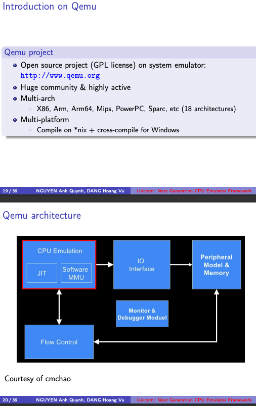
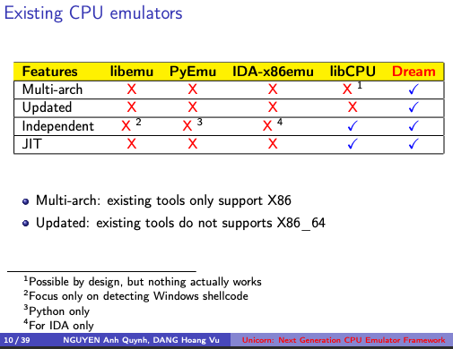
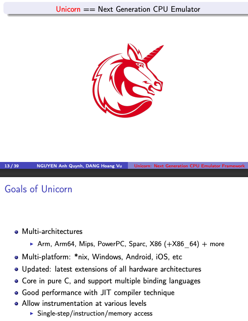

# Unicorn概览

* `Unicorn`
  * 一句话描述：终极CPU模拟器=The ultimate CPU emulator
  * 也称为：`Unicorn引擎`
  * 是什么
    * CPU模拟器
    * 跨平台跨语言的CPU仿真库
  * 功能：支持多种架构
    * ARM, AArch64(=ARM64=ARMv8), M68K, MIPS, Sparc, PowerPC, RISC-V, S390x(=SystemZ), TriCore, X86/x86_64
  * 典型用途：模拟调试，用逆向的静态分析难以逆向出代码逻辑的函数、代码、（so等）文件
  * 功能特点
    * API好用 == 干净/简单/轻量级/直观的架构中立的API
    * 支持多种语言 == 以纯C语言实现，可绑定多种其他语言：Pharo、Crystal、Clojure、VB、Perl、Rust、Haskell、Ruby、Python、Java、Go、D、Lua、JS、.NET、Delphi/Pascal、MSVC
    * 支持多种主机系统 == 原生支持 Windows 和 *nix（已确认 macOS、Linux、Android、*BSD 和 Solaris）
    * 通过使用JIT技术实现高性能
    * 支持各种级别的细粒度检测
    * 线程安全的设计
  * 具体实现
    * 底层是依赖于/参考自QEMU的
      * 依赖的QEMU的版本
        * `< 2.0.0 Unicorn`：基于`QEMU v2.2.1`
        * `>= 2.0.0 Unicorn`：基于`QEMU v5.0.1`

## Unicorn对比QEMU

* 类比
  * 如果说QEMU像汽车，那Unicorn就像（汽车最核心的）发动机
* 对比
  * QEMU：模拟整个电脑（CPU+其他：内存，设备、BIOS、固件等等）
    * 
  * unicorn：只模拟CPU
    * 
    * 
* 结论：
  * Unicorn = QEMU的CPU + 额外优化
    * 即：unicorn是把QEMU中模拟CPU的部分提取出来后，加上其他各种优化
    * 相对QEMU来说，Unicorn有更多的优势
      * 是个框架，支持当做库去调用
      * 用起来更加灵活
      * 支持更多调试手段
      * 线程安全=支持同时多个线程使用
      * 支持更多其他语言接口=bindings
      * 更加轻量级
      * 相对更加安全（和QEMU比减少了攻击面）
